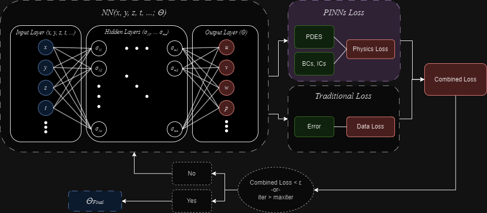

<!-- Back to top -->
<a name="readme-top"></a>

<!-- PROJECT LOGO -->
<br />
<div align="center">
  <a href="_">
    
  </a>

  <h3 align="center">Hands-On Learning PINNs</h3>

  <p align="center">
    A companion GitHub repo to the research paper, pre-print draft <a href="">here</a> (link pending paper revision).
    <br>
    <br>
    <a href="https://github.com/cdenq/">GitHub Home</a>
    ·
    <a href="https://github.com/cdenq/pinns-teaching-uis/issues">Report Bug </a>
  </p>
</div>

<!-- Table of Contents -->
# Table of Contents
<details>
  <summary>Table of Contents</summary>
  <ol>
    <li>
      <a href="#exe-sum">Executive Summary</a>
    </li>
    <li>
      <a href="#started">Getting Started</a>
      <ul>
        <li><a href="#started-setup">Setup</a></li>
        <li><a href="#started-directory">Directory</a></li>
      </ul>
    </li>
    <li>
      <a href="#ack">Acknowledgements</a>
    </li>
    <li><a href="#contact">Contact</a></li>
  </ol>
</details>

<p align="right">(<a href="#readme-top">back to top</a>)</p>

<!-- ABOUT THE PROJECT -->
<a name="exe-sum"></a>
# Executive Summary

The following is the companion GitHub repo for our research paper "Hands-On Learning with Physics-Informed Neural Networks: A New Paradigm for Differential Equations". This is provided as-is for math faculty, educators, and students alike to use in teaching PINNs, deep learning, and differential equations in their classroom settings. This repo is not intended to be "production-ready" or a "complete, self-guided tour", but rather, is a **supplemental resource in understanding our paper**.

For this paper, the code-base was elected to be on Google Colab. This repo is exists merely as a redirect path.

<!-- ABOUT THE PROJECT -->
<a name="started"></a>
# Getting Started

<a name="started-setup"></a>
## Setup

Visit the <a href="https://colab.research.google.com/drive/1H9-N1GBYdBqTjg9msqR1b5ahXuhRl4P6?authuser=2">Google Colab code base</a> and copy it to your own Google Drive. Adjust the folder variables within the code base if you prefer a different save location; otherwise, the code is ready to be run "as-is".

<p align="right">(<a href="#readme-top">back to top</a>)</p>

<a name="started-directory"></a>
## Directory

```bash
hands-on-learning-pinns                       
├── repo_assets
│   └── header.png                  # the README's header image
├── .gitignore
├── LICENSE
└── README.md
```

<p align="right">(<a href="#readme-top">back to top</a>)</p>

<!-- ACKNOWLEDGEMENTS -->
<a name="ack"></a>
# Acknowledgments
Full acknowledgements and citations are provided in the linked paper. 

<p align="right">(<a href="#readme-top">back to top</a>)</p>

<!-- CONTACT -->
<a name="contact"></a>
# Contact

To directly message me or setup a time to chat virtually, see my [LinkedIn](https://www.linkedin.com/in/cdenq/) and [Calendly](https://calendly.com/christopherkd/coffee-chats) links.

If you're curious about more projects, check out my [website](https://cdenq.github.io/) or [GitHub](https://github.com/cdenq).

<p align="right">(<a href="#readme-top">back to top</a>)</p>